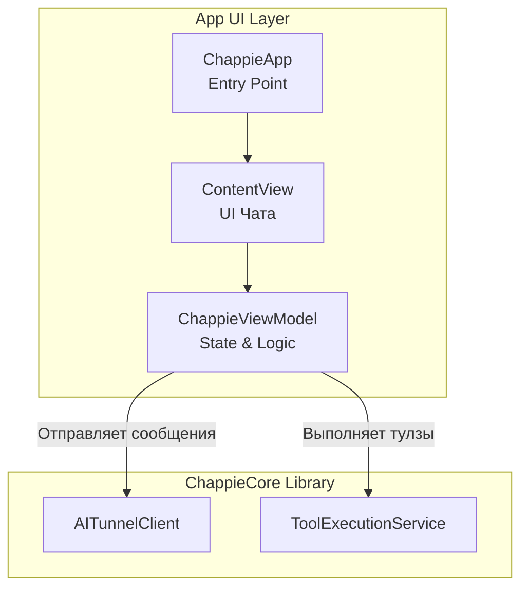

# Chappie App Architecture

```mermaid
graph TD
    subgraph App UI Layer
        ChappieApp[ChappieApp<br/>Entry Point]
        ContentView[ContentView<br/>UI Чата]
        ChappieViewModel[ChappieViewModel<br/>State & Logic]
    end

    subgraph ChappieCore Library
        AITunnelClient[AITunnelClient]
        ToolExecutionService[ToolExecutionService]
    end

    ChappieApp --> ContentView
    ContentView --> ChappieViewModel
    ChappieViewModel -->|Отправляет сообщения| AITunnelClient
    ChappieViewModel -->|Выполняет тулзы| ToolExecutionService
```
