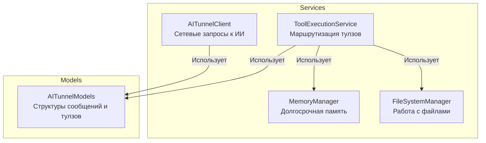

# ChappieCore Architecture

```mermaid
graph TD
    subgraph Services
        AITunnelClient[AITunnelClient<br/>Сетевые запросы к ИИ]
        ToolExecutionService[ToolExecutionService<br/>Маршрутизация тулзов]
        FileSystemManager[FileSystemManager<br/>Работа с файлами]
        MemoryManager[MemoryManager<br/>Долгосрочная память]
    end

    subgraph Models
        AITunnelModels[AITunnelModels<br/>Структуры сообщений и тулзов]
    end

    ToolExecutionService -->|Использует| FileSystemManager
    ToolExecutionService -->|Использует| MemoryManager
    AITunnelClient -->|Использует| AITunnelModels
    ToolExecutionService -->|Использует| AITunnelModels
```
