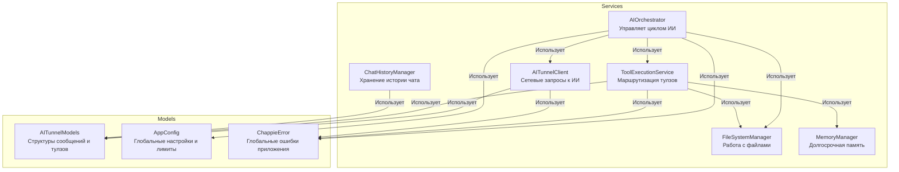

# ChappieCore Architecture

```mermaid
graph TD
    subgraph Services
        AIOrchestrator[AIOrchestrator<br/>Управляет циклом ИИ]
        AITunnelClient[AITunnelClient<br/>Сетевые запросы к ИИ]
        ToolExecutionService[ToolExecutionService<br/>Маршрутизация тулзов]
        FileSystemManager[FileSystemManager<br/>Работа с файлами]
        MemoryManager[MemoryManager<br/>Долгосрочная память]
        ChatHistoryManager[ChatHistoryManager<br/>Хранение истории чата]
    end

    subgraph Models
        AITunnelModels[AITunnelModels<br/>Структуры сообщений и тулзов]
        AppConfig[AppConfig<br/>Глобальные настройки и лимиты]
        ChappieError[ChappieError<br/>Глобальные ошибки приложения]
    end

    AIOrchestrator -->|Использует| AITunnelClient
    AIOrchestrator -->|Использует| ToolExecutionService
    AIOrchestrator -->|Использует| FileSystemManager
    AIOrchestrator -->|Использует| AppConfig
    AIOrchestrator -->|Использует| ChappieError

    ToolExecutionService -->|Использует| FileSystemManager
    ToolExecutionService -->|Использует| MemoryManager
    ToolExecutionService -->|Использует| ChappieError
    AITunnelClient -->|Использует| AITunnelModels
    AITunnelClient -->|Использует| ChappieError
    ToolExecutionService -->|Использует| AITunnelModels
    ChatHistoryManager -->|Использует| AITunnelModels
```